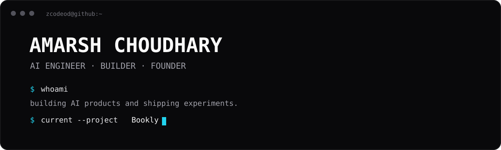
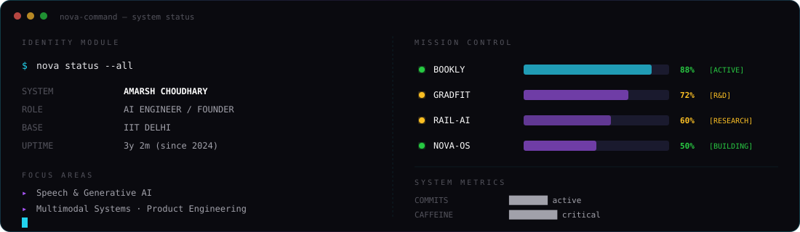
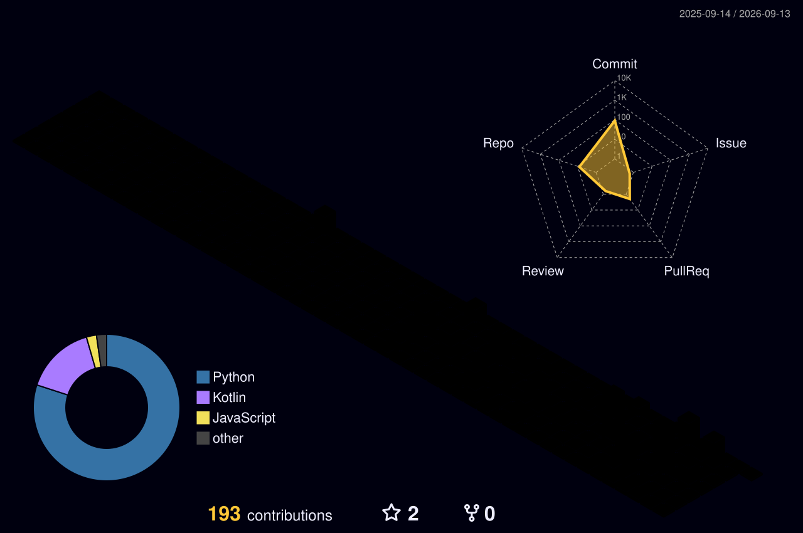

<div align="center">



</div>

## `~/about`

I'm an AI/ML builder at **IIT Delhi**. I like taking ideas from a rough prototype to something people can actually use.

```text
focus/
├── speech & generative AI
├── multimodal systems
├── product engineering
└── turning research into products
```

<div align="center">



</div>

## `~/currently-building`

### 🎧 Bookly

**AI audiobook infrastructure for expressive, multi-character narration.**

Character-consistent voices · emotion-aware speech · multilingual generation · production audio pipelines

[Explore Bookly →](https://booklyaudio.com)

---

## `~/selected-work`

<table>
<tr>
<td width="50%">

### 🎧 Bookly
AI audiobook platform focused on expressive, multi-character narration.

`Python` `PyTorch` `FastAPI` `TypeScript`

</td>
<td width="50%">

### 👗 GradFit
Fashion intelligence and virtual try-on experiments using generative AI.

`Python` `Diffusion` `Next.js`

</td>
</tr>
<tr>
<td width="50%">

### 🚂 Rail AI
Multimodal railway fault detection using visual and audio signals.

`VLM` `Audio` `Computer Vision`

</td>
<td width="50%">

### 🧠 ML Experiments
Models, training systems, speech experiments and research prototypes.

`Python` `PyTorch` `Jupyter`

</td>
</tr>
</table>

---

## `~/stack`

<div align="center">


</div>

---

## `~/github`

<div align="center">


<br>


<br>


</div>

---

## `~/contributions`

<div align="center">


<br><br>



</div>

---

## `~/timeline`

```text
2024  ──  started going deep into AI / software
  │
2025  ──  IIT Delhi · ML projects · research
  │
2026  ──  Bookly · multimodal AI · shipping products
  │
  └───→ next: building something interesting
```

---

<div align="center">

### BUILD · SHIP · LEARN · REPEAT

<br>

<a href="https://github.com/Zcodeod-OG">

</a>
<a href="https://booklyaudio.com">

</a>

<br><br>

<sub>© Amarsh Choudhary · built with Markdown, SVGs and too much coffee.</sub>

</div>
