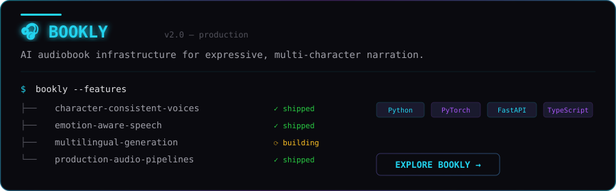
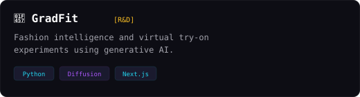
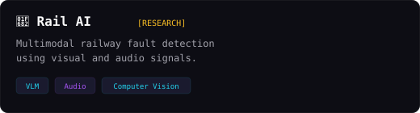
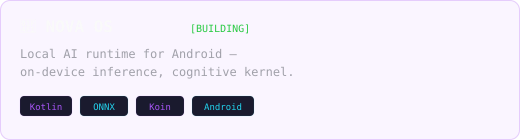

<div align="center">




<br>


<br>

<a href="https://git.io/typing-svg">
  
</a>

<br>


</div>

---

<div align="center">


</div>

---

## `~/currently-building`

<div align="center">

<a href="https://booklyaudio.com">

</a>

</div>

---

## `~/selected-work`

<table>
<tr>
<td width="50%">

<a href="https://booklyaudio.com">

</a>

</td>
<td width="50%">

<a href="https://gradfit.tech">

</a>

</td>
</tr>
<tr>
<td width="50%">

<a href="https://github.com/Zcodeod-OG/Rail-AI">

</a>

</td>
<td width="50%">

<a href="https://github.com/Zcodeod-OG/NOVA---A-Mobile-OS">

</a>

</td>
</tr>
</table>

---

## `~/stack`

```
┌──────────────────────────────────────────────────────────────────────┐
│  ~/stack                                                  [LOADED]  │
└──────────────────────────────────────────────────────────────────────┘
```

<div align="center">


<br>


</div>

---

## `~/github`

```
┌──────────────────────────────────────────────────────────────────────┐
│  ~/github                                              [TELEMETRY]  │
└──────────────────────────────────────────────────────────────────────┘
```

<div align="center">


<br>


<br>


</div>

---

## `~/contributions`

```
┌──────────────────────────────────────────────────────────────────────┐
│  ~/contributions                                        [ORGANIC]   │
└──────────────────────────────────────────────────────────────────────┘
```

<div align="center">


<br><br>


</div>

---

## `~/timeline`

```
╔═══════════════════════════════════════════════════════════════════════╗
║  MISSION LOG — CLASSIFIED                                 [ACTIVE]  ║
╠═══════════════════════════════════════════════════════════════════════╣
║                                                                       ║
║  [2024]  ░░  ORIGIN    — Started deep-diving into AI                  ║
║          ░░              & software engineering                        ║
║          ░░                                                           ║
║  [2025]  ░░  TRAINING  — IIT Delhi · ML projects · research           ║
║          ░░                                                           ║
║  [2026]  ██  DEPLOYED  — Bookly · multimodal AI · shipping            ║
║          ██              products at scale                             ║
║          ██                                                           ║
║  [NEXT]  ▓▓  QUEUED    — building something no one expects            ║
║                                                                       ║
╚═══════════════════════════════════════════════════════════════════════╝
```

---

<div align="center">

### `BUILD · SHIP · LEARN · REPEAT`

<br>

<a href="https://github.com/Zcodeod-OG">

</a>
<a href="https://booklyaudio.com">

</a>

<br><br>

<sub>© Amarsh Choudhary — powered by NOVA-OS, caffeine, and gradient descent.</sub>

<br>


</div>
