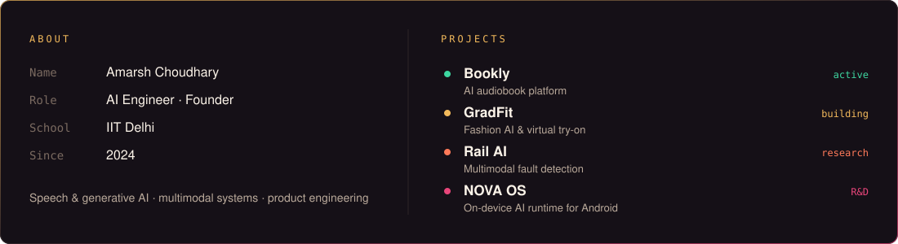
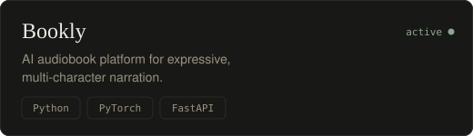
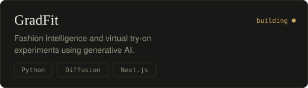
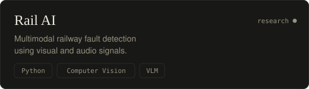
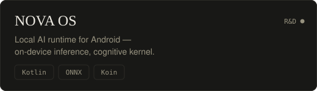
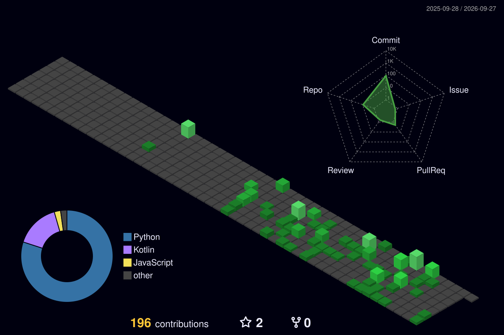

 

 

 

## Selected Work

<table>
<tr>
<td width="50%">

</td>
<td width="50%">

</td>
</tr>
<tr>
<td width="50%">

</td>
<td width="50%">

</td>
</tr>
</table>

## Stack

 

## GitHub

 

 

## Contributions

  

## Timeline

- **2024** — Started going deep on AI and software engineering.
- **2025** — IIT Delhi: ML projects and research.
- **2026** — Building Bookly and multimodal AI products.

  

© Amarsh Choudhary

